האתגר שבכדור, מסע בזמן
======================

חמשת הגופים נקראים על שם אפלטון, למרות שאפלטון לא גילה אותם, הם התגלו
הרבה קודם, כאלף שנה לפני אפלטון. ארכיאולוגים מצאו בסקוטלנד מאות כדורי
אבן שנוצרו בתקופה הנאוליתית, על פניהם סותתו עיטורים ובליטות מסודרות. לא
ידוע אם הייתה מטרה שימושית לכדורים אבל ברור שיש כאן חיפוש של החלוקה
הסימטרית של פני הכדור. מתוך מאות הכדורים שנמצאו, בלטו במיוחד חמישה
כדורים מיוחדים, חמשת האפשרויות לחלוקה סימטרית של הכדור. אלו הם הגופים
האפלטוניים בגרסתם הכדורית.

{width="346"
height="95"}

הכדורים המסותתים הם העדות הקדומה ביותר של החיפוש אחר הסימטריה בגוף תלת
ממדי, בכדור. ושל הגילוי המפתיע: יש רק חמש חלוקות סימטריות של הכדור, או
בצורה מעשית יותר: יש רק חמש דרכים לסידור סימטרי של נקודות על פני כדור,
אוסף הנקודות יוצר את חמשת הגופים האפלטוניים.

נחזור בזמן 3000 שנה לאחור ונצא לדרך
===================================

אנו הולכים בעקבותיהם של האנשים הסקרנים שראו את האתגר שבכדור, שחיפשו את
החלוקה הסימטרית שלו, נשתמש בכדורי פלסטיק ונסמן בעזרת טוש, נניח שאין לנו
ידע מוקדם, אפילו הקובייה לא היתה ידועה באותה תקופה. נחפש את האפשרויות
השונות לסמן נקודות על פני הכדור בצורה סימטרית, כלומר מפוזרות במרחקים
שווים ולא פוגעות בשלמות המיוחדת של הכדור. פיזור הנקודות צריך להיות כזה
שהכדור עדיין יראה אותו דבר בכל תנוחה. נקודה אחת על פני הכדור פוגעת כמובן
בסימטריה, נתחיל משתי נקודות, ממוקמות בצורה סימטרית זו לזו, כמו קוטב
צפוני ודרומי, כמו פיטם ועוקץ בפרי.

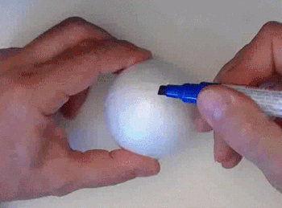 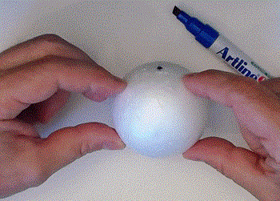

הסימטריה של שתי הנקודות מגדירה מישור סימטריה שעובר באמצע.

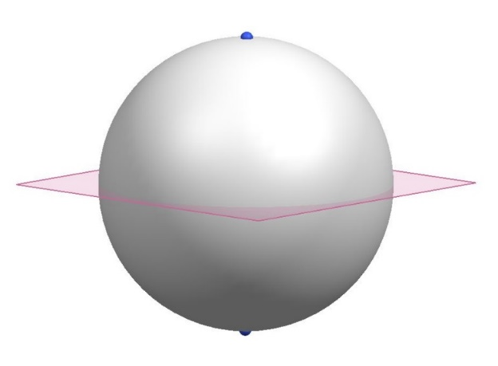

מישור זה מגדיר את \"קו המשווה\".

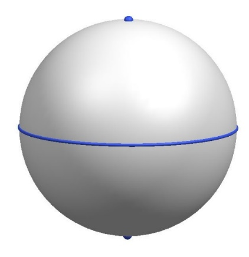

קו המשווה הוא מעגל גדול, מעגל גדול בכדור הוא מעגל שמרכזו במרכז הכדור,
וכמו בדוגמא זו, הוא מחלק את הכדור לשני חלקים שווים. על קו המשווה ניתן
לפזר נקודות בחלוקה שווה בכל מספר רצוי. בדוגמא זו: 8 נקודות על המעגל ושתי
נקודת בקטבים

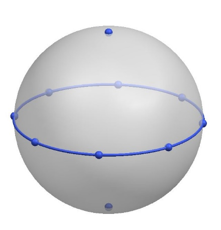

למרות שהנקודות על המעגל מפוזרות באופן שווה זוהי לא חלוקה סימטרית של
כדור, הנקודות על קו המשווה קרובות זו לזו אבל רחוקות מהנקודות על הקטבים.
רואים גם שהכדור עם הנקודות לא נראה אותו דבר בכל תנוחה, הוא מוגבל לסיבוב
סביב ציר אחד. נמשיך להתבונן בחלוקה הזו כדי שנוכל להעריך את החלוקות
הסימטריות שנגלה בהמשך. נסמן על הכדור קוי אורך בהתאמה לחלוקה של קו
המשווה.

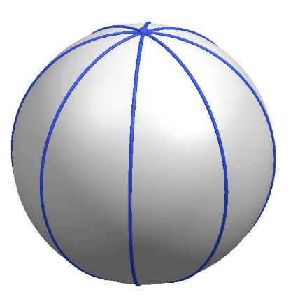

נקבל חלוקה של הכדור לפלחים, כמו פלחים בתפוז

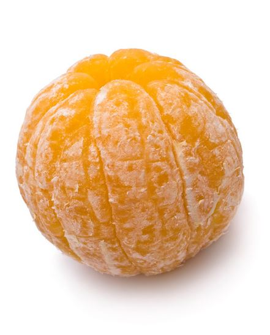

חלוקה זו מחלקת את הכדור לחלקים שווים אבל היא לא ממש תלת ממדית, היא בעצם
חלוקה של אחד המעגלים בכדור. נראה בהמשך שבחלוקות הסימטריות נוכל להעביר
מישור בין הנקודות ולקבל גוף בעל פאות, כאן לא ניתן לעשות זאת. נחזור
לקטבים ולקו המשווה, הפעם נפזר רק 4 נקודות על קו המשווה, כלומר 6 נקודות
על פני הכדור.

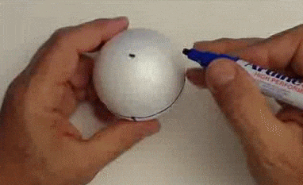

שימו לב, זוהי חלוקה מיוחדת: כל נקודה נמצאת במרחק שווה לנקודות השכנות,
מרחק של רבע סיבוב. הכדור נראה אותו הדבר בכל תנוחה: אם נסובב אותו כך
שנקודה על המשווה תהיה בקוטב, הכדור יראה בדיוק אותו הדבר. נראה בהמשך שיש
רק חמש חלוקות מיוחדות כאלה, זו אחת מהן.

זוהי כנראה החלוקה האינטואיטיבית ביותר, כשאנו חושבים על החוקרים הקדומים
שסיתתו את כדורי האבן אנו מנחשים שאותה גילו ראשונה.

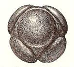 

מאוחר יותר, המלומדים ביוון העתיקה, העבירו קווים ישרים בין הנקודות,
התעלמו מהכדור ונוצר גוף בעל שמונה פאות מישוריות, האוקטהדרון.

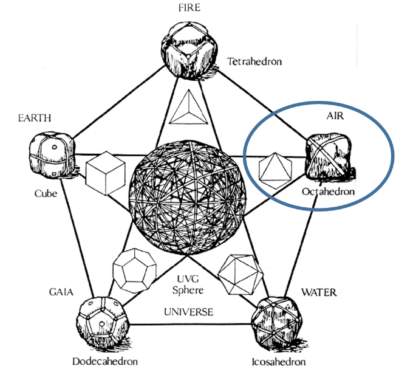
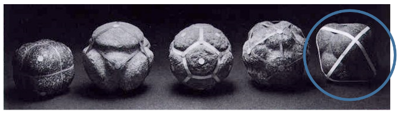

כך צייר אותו לאונרדו דה וינצ\'י בספר \"על הפרופורציה האלוהית\"

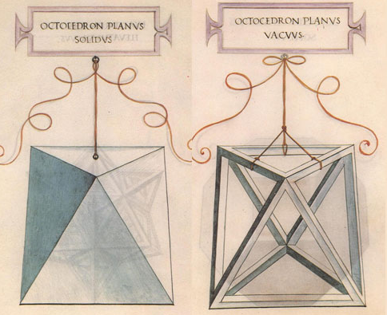
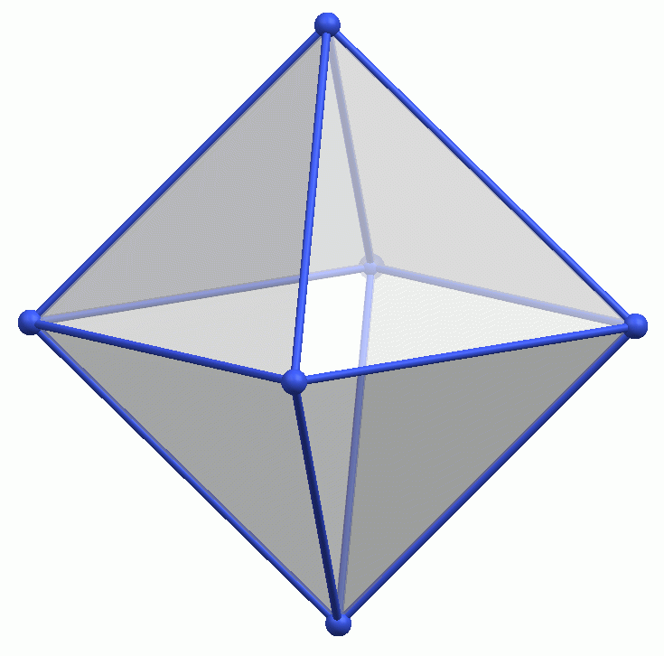
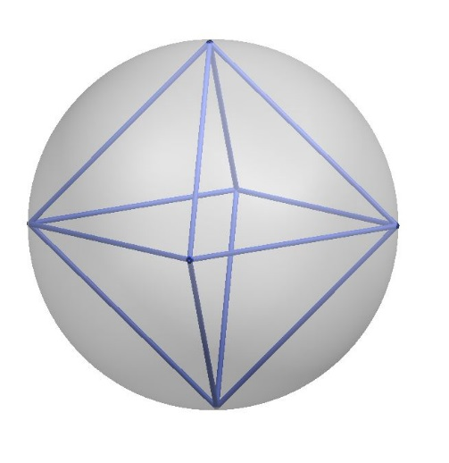

עכשיו, כשיש לנו כבר חלוקה אחת של הכדור, ננסה להשתמש בה ולמצוא חלוקה
נוספת. לגוף שנוצר יש 8 פאות, או 8 אזורים על הכדור, גם הם מהווים חלוקה
סימטרית. נסמן נקודה במרכז כל פאה, או אזור בכדור, נקבל 8 נקודות בפיזור
סימטרי על הכדור.

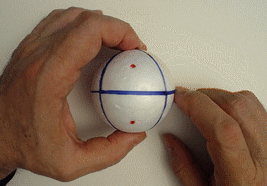

קיבלנו חלוקה חדשה של הכדור, 8 נקודות. נחבר את הנקודות בקווים, על הכדור
אלו הן כמובן קשתות של מעגל גדול.

קיבלנו את הקובייה,

 

כך צייר אותה לאונרדו:

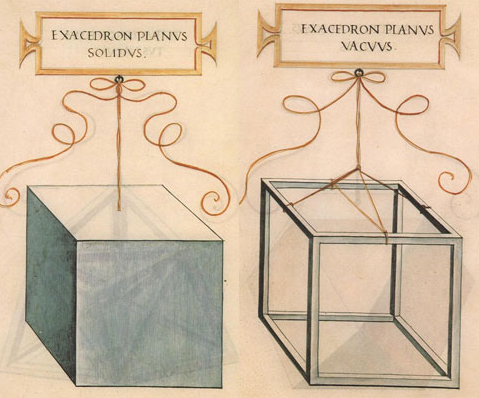

נו מבחינים בתופעה מעניינת, קשר מיוחד בין הקובייה לאוקטהדרון: הם נקראים
זוג דואלי. זוג דואלי הם שני גופים שמספר הפאות של האחד הוא כמספר
הקודקודים של השני ולהפך. כך יוצא שבמרכז כל פאה של האחד יש קודקוד של
האחר. נשתמש בערכה של MATHRILLS כדי לבנות זוג דואלי כזה:

 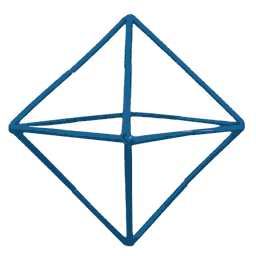
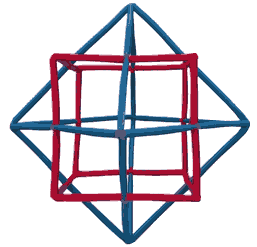

כשהזוג הדואלי מוצג כך, ניתן לראות שעל כל פאה של הקובייה בנויה פירמידה עם
אחד הקדקודים של האוקטהדרון ועל כל פאה של האוקטהדרון בנויה פירמידה עם אחד
מקודקודי הקובייה. תכונה נוספת של זוג דואלי: לשני הגופים יש מספר שווה של
מקצועות, מקצועות הם הקווים שבין הפאות, או המוטות שבערכות של MATHRILLS.
לקוביה ולאוקטהדרון יש 12מוטות, או 12 קווים אדומים ו 12 קווים כחולים על
הכדור. בצורת הצגה כמו זו, הבנויה מהערכה של MATHRILLS, ניתן לראות
שהמקצועות ניצבים וחוצים זה את זה. הם יוצרים סימן + , בדרך כלל הם באורך
שונה. נמשיך לחפש חלוקה נוספת של הכדור, הפעם נשתמש בסידור הסימטרי של פאות
הקוביה, נעביר קו אלכסוני בכל פאה, נקבל 6 קוים, כמספר הפאות של הקוביה.
הקוים מחברים 4 קודקודים מתוך 8 הקודקודים של הקוביה. קיבלנו סידור סימטרי
של 4 נקודות על כדור.

 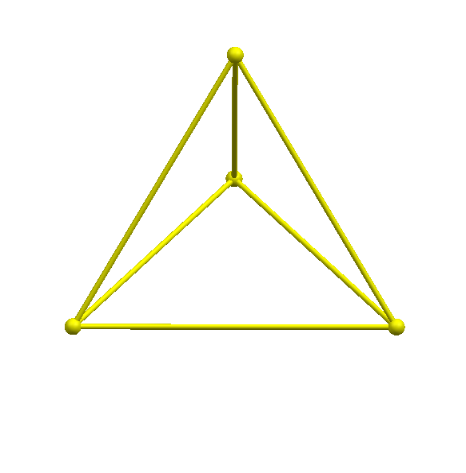
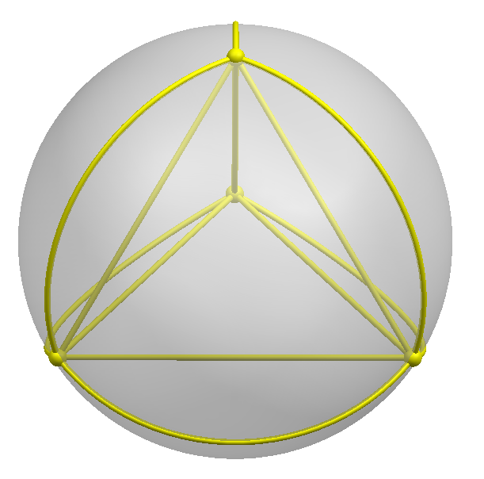

קיבלנו גוף שנקרא טטרהדרון, פירמידה בעלת 4 פאות, כל פאה היא משולש שווה
צלעות.

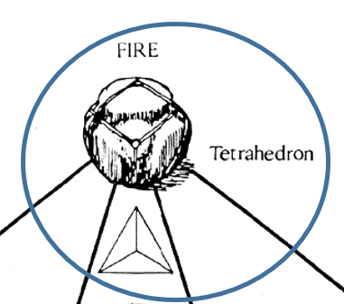 

שרטט אותו יפה לאונרדו דה וינצ\'י

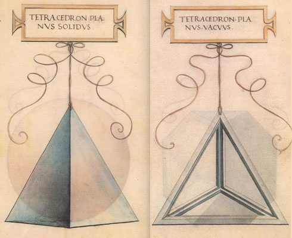

במבט ראשון הוא שונה מאד מהקובייה, נראה שאין ביניהם כל קשר. אבל כיוון שיש
לו ולקובייה משהו משותף הם משתלבים זה בזה בצורה מושלמת: מספר הפאות של
הקובייה שווה למספר המקצועות (או המוטות) של הטטרהדרון. הקשר הזה, בנוסף
לעובדה החשובה ששניהם גופים שנמצאים בסימטריה על כדור, מבטיחים שילוב מושלם
של שני הגופים: על כל אחת מששת הפאות של הקובייה יהיה אחד מששת המקצועות של
הטטרהדרון.

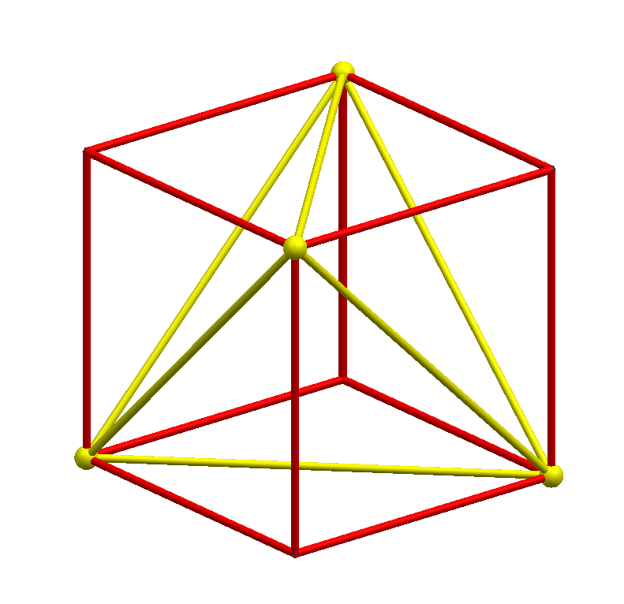

חמשת הגופים האפלטוניים הם בעלי סימטריה מושלמת, כאלה שיוצרים חלוקה של
כדור או נוצרים מחלוקה של כדור, לכן, כאשר יש התאמה מספרית כלשהיא בין שני
גופים אז ניתן לשלב אותם בצורה מושלמת זה בזה. הזוג הזה נראה שונה במבט
ראשון, אבל כמו שראינו, מתקבל שילוב מעניין.

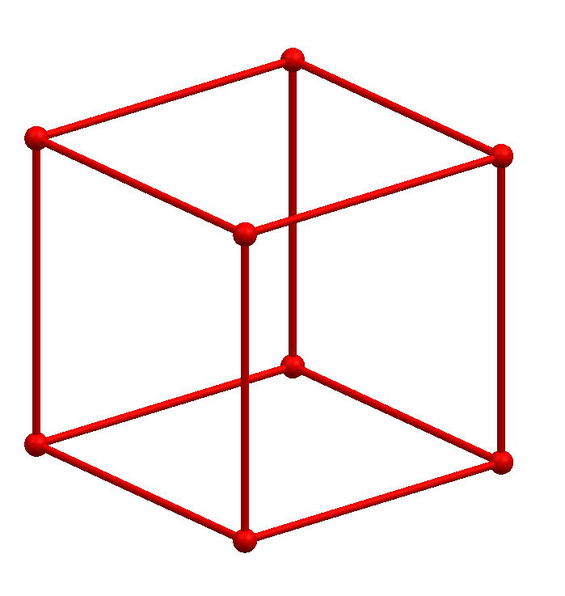 

טטרהדרון שני בקובייה: ראינו שהטטרהדרון בנוי על חצי מהקדקודים של הקובייה
ומסמן אלכסון על כל פאה, כלומר ניתן לבנות טטרהדרון נוסף על הקדקודים
האחרים, על כל פאה של הקובייה יהיו שני אלכסונים.

הגוף שנוצר מהשילוב של שני הטטרהדרונים קיבל שמות שונים כי ניתן ליצור אותו
בדרכים שונות, נתבונן בשרטוטים של לאונרדו:

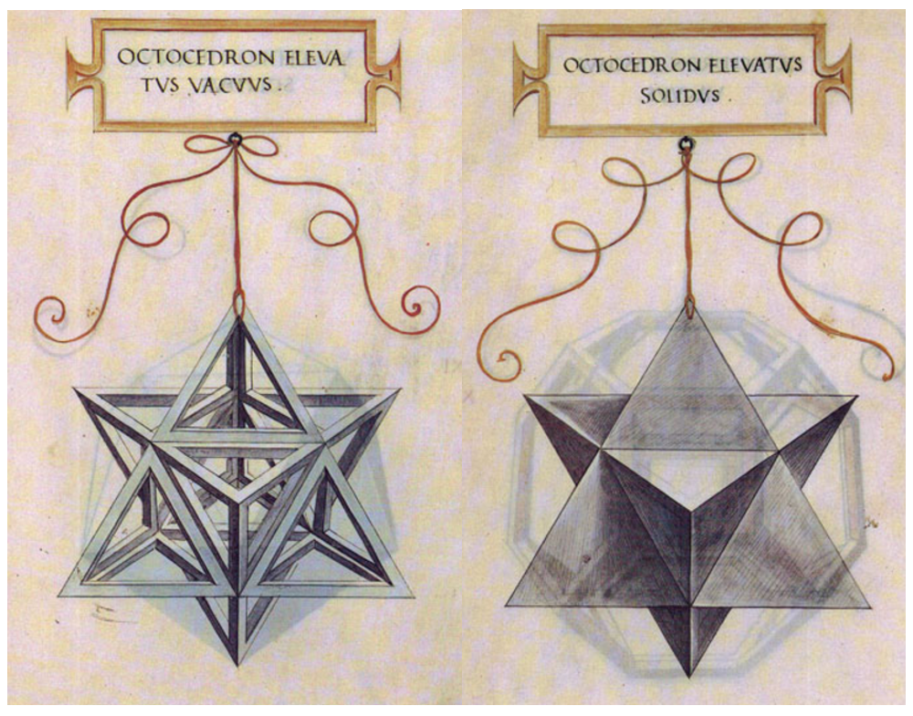

שני הטטרהדרונים הם זוג דואלי: על כל פאה של הטטרהדרון האחד בנויה פירמידה
עם קדקוד של הטטרהדרון השני ולהפך. בן הזוג של הטטרהדרון הוא טטרהדרון
נוסף, זאת כיוון שבטטרהדרון מספר הפאות שווה למספר הקדקודים. נמשיך לחפש
חלוקה נוספת של הכדור, נחזור לקובייה המשורטטת על הכדור, הפעם נסמן 2
נקודות בכל אחת מפאות הקובייה.

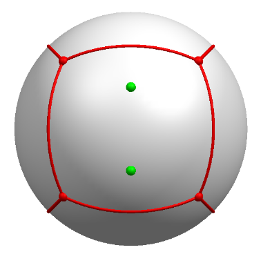

סימון הנקודות נעשה בצורה מיוחדת: המרחק בין שתי הנקודות זהה למרחק של כל
אחת מהן לנקודות הסמוכות של הקובייה. כך נוצרים 5 קווים חדשים על כל פאה של
הקובייה. הקווים החדשים הם בעלי אורך שווה.

לקובייה 6 פאות, על כל אחת נסמן 2 נקודות, נקבל 12 נקודות חדשות. פרט נוסף
שבלעדיו אין סימטריה: הקו האמצעי מחליף כיוון, באחת הפאות הוא \"אופקי\"
ובפאות הסמוכות הוא \"אנכי\".

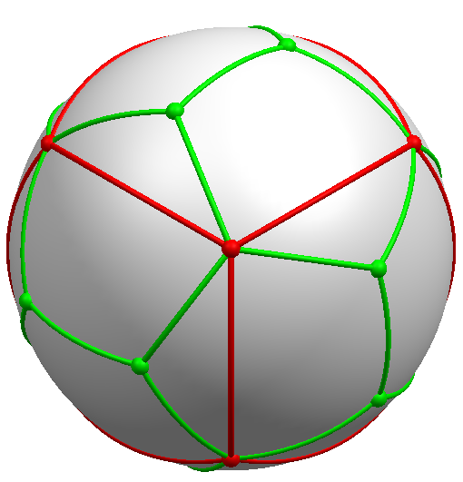

נתבונן רק בנקודות: 8 נקודות אדומות של הקובייה ועוד 12 נקודות חדשות: 20
נקודות. קיבלנו חלוקה חדשה: 20 נקודות בפיזור סימטרי.

שרטוט הקווים החדשים על הקובייה:

ראינו שלגוף החדש יש 20 קדקודים, שרטטנו 5 קווים על כל פאה של הקובייה,
לקובייה יש 6 פאות לכן קיבלנו 30 קווים חדשים. הקווים יוצרים 12 פאות בצורת
מחומש.

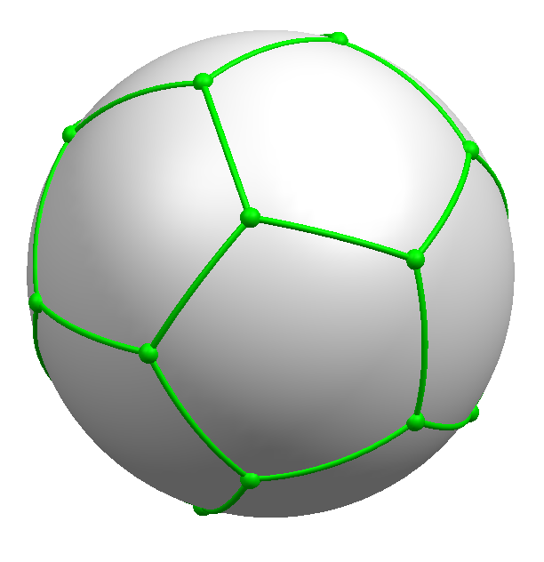

מספר המחומשים הוא כמספר המקצועות של הקובייה, 12, כלומר בכל מחומש יש
אלכסון שהוא אחד הקווים של הקובייה. (אלכסון במחומש אינו עובר דרך המרכז)
הגוף החדש נקרא דודקהדרון, ובעברית תריסריון, כלומר גוף בעל 12 פאות.

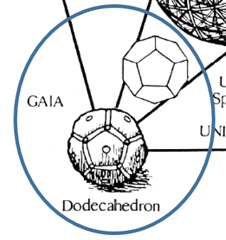 

נראה אותו ואת הקובייה כגופים בעלי קווים ישרים:

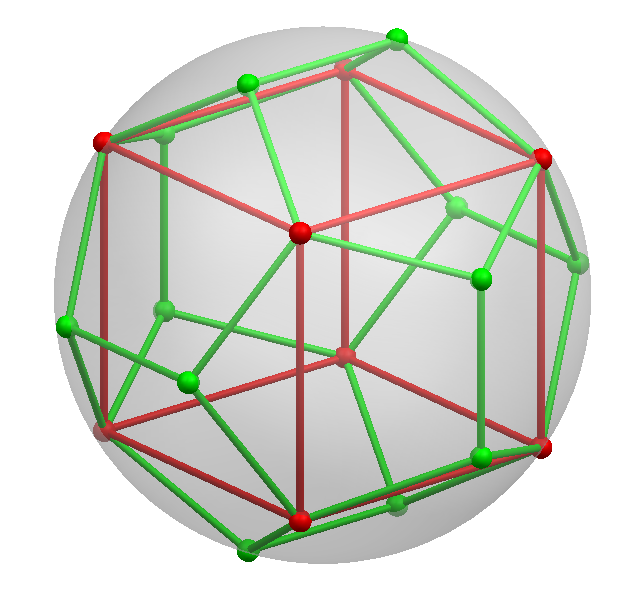

נראה כאילו יצרנו \"גג\" על כל פאה של הקובייה וכך נוצר התריסריון,

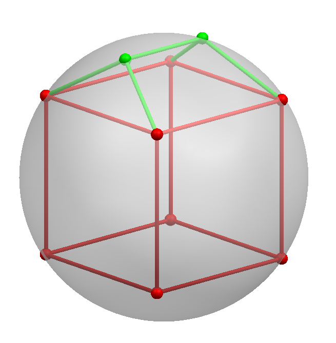

כל מחומש נוצר מצלעות של שני \"גגות\" סמוכים, זה לא מובן מאיליו שחמשת
הצלעות הן על מישור משותף ויוצרים פאה מישורית. קשה להעביר בתמונה את
התריסריון, לאונרדו דה וינצ\'י עשה זאת טוב:

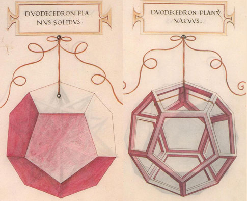

נעבור לחלוקה החמישית והאחרונה, הפעם נסמן נקודה במרכז כל מחומש של
התריסריון, נקבל 12 נקודות.

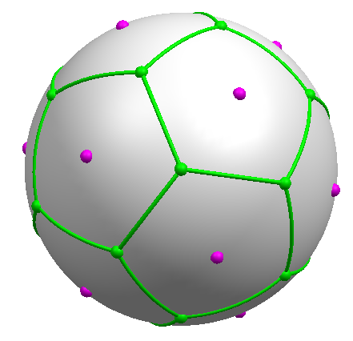

נחבר את הנקודות בקווים

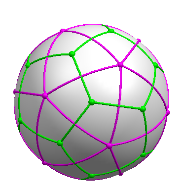

קיבלנו את האיקוסהדרון, או בעברית, עשרימון, גוף בעל עשרים פאות.

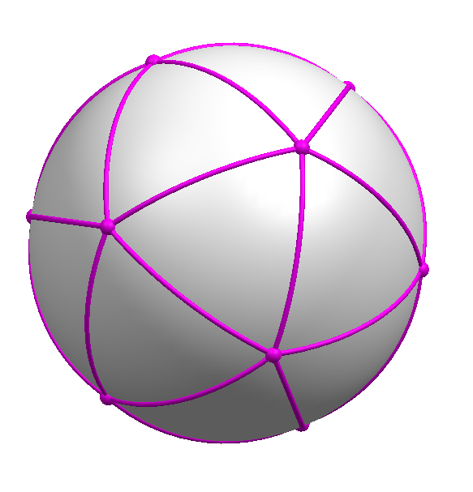 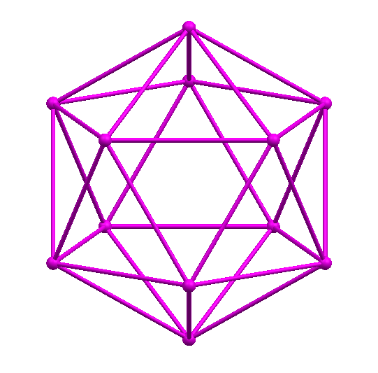

קשה לקלוט אותו בתמונה, אצל לאונרדו הוא יותר ברור.

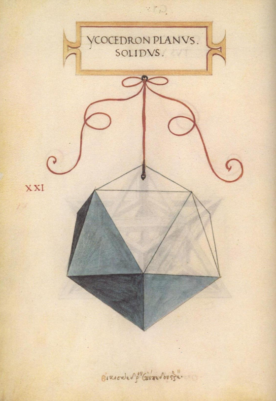
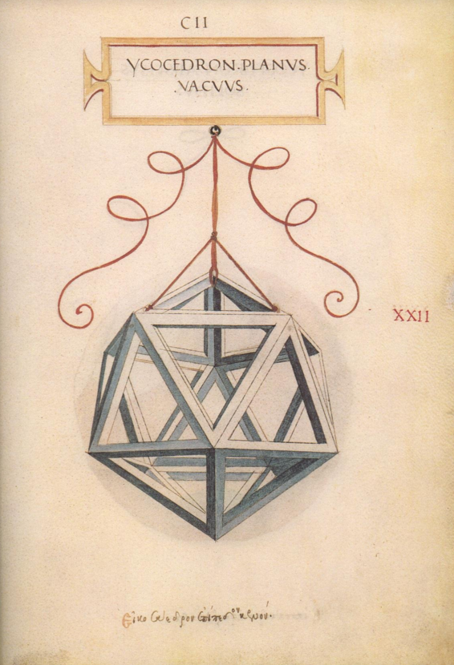

העשרימון והתריסריון הם זוג דואלי, מספר הפאות של האחד הוא כמספר הקדקודים
של השני ולהפך.
